# Arithmetix — A-Level Maths E-Learning Platform

A full-stack e-learning web application designed to support UK A-Level maths students in exam preparation. Arithmetix provides revision notes, practice worksheets, past exam papers (AQA, Edexcel, OCR), and interactive quizzes — all within a role-based platform where teachers can manage classes, set assignments, and provide graded feedback.

> **Built with:** Vue 2 · TailwindCSS 3 · Webpack 5 · Node.js · Express 4 · PostgreSQL

---

## Table of Contents

- [Features](#features)
- [Architecture Overview](#architecture-overview)
- [Tech Stack & Key Decisions](#tech-stack--key-decisions)
- [Screenshots](#screenshots)
- [Getting Started](#getting-started)
- [Project Structure](#project-structure)
- [API Reference](#api-reference)
- [Testing](#testing)
- [Deployment](#deployment)
- [Author](#author)

---

## Features

### Student Experience
- **Interactive Quizzes** — Randomised 10-question quizzes drawn from CSV question banks, with animated progress tracking, score breakdown by category, and Chart.js visualisations
- **Module Resources** — Browse and download revision notes and practice worksheets organised by module (C1–C4, M1, S1)
- **Exam Papers** — Filter and access past papers from AQA, Edexcel, and OCR with mark schemes and solutions
- **Homework Dashboard** — View assignments, submit work, and receive graded feedback from teachers

### Teacher Experience
- **Class Management** — Create, rename, and delete classes; add or remove students with real-time updates
- **Assignment Workflow** — Set assignments with deadlines, review submissions, and provide grades and feedback
- **School Overview** — View all classes and students across the school

### Platform
- **JWT Authentication** — Secure token-based login with role-based access control (student, teacher, admin)
- **Responsive Design** — Mobile-first UI built with TailwindCSS, functional across all screen sizes
- **Reusable Component System** — Generic modal dialogs (Alert, Confirm, Form) used across the application
- **PostgreSQL Database** — Relational schema with 8 tables, bcrypt password hashing via `pgcrypto`, and parameterised queries throughout

---

## Architecture Overview

```
┌─────────────────────────────────────────────────────┐
│                   Frontend (Vue 2 SPA)              │
│  ┌──────────┐  ┌──────────┐  ┌───────────────────┐ │
│  │  Student  │  │  Teacher │  │  General (Auth,   │ │
│  │ Dashboard │  │Dashboard │  │  Navigation, etc) │ │
│  │ Quizzes   │  │ Classes  │  │  Alert / Confirm  │ │
│  │ Modules   │  │ Assigns  │  │  Profile / 404    │ │
│  └──────────┘  └──────────┘  └───────────────────┘ │
│       ▼               ▼               ▼             │
│          Axios / Fetch  →  REST API                 │
└─────────────────────────┬───────────────────────────┘
                          │ HTTP (JSON)
┌─────────────────────────▼───────────────────────────┐
│                Backend (Express 4)                   │
│  ┌────────────┐  ┌────────────┐  ┌───────────────┐  │
│  │  app.js    │  │   db.js    │  │  Resource      │  │
│  │  (Routes)  │  │  (Queries) │  │  Singletons    │  │
│  │  25+ REST  │  │  Pooled    │  │  EP, RN, WS,   │  │
│  │  endpoints │  │  pg client │  │  Quiz (CSV→JSON)│  │
│  └────────────┘  └─────┬──────┘  └───────────────┘  │
└─────────────────────────┬───────────────────────────┘
                          │ SQL (parameterised)
┌─────────────────────────▼───────────────────────────┐
│              PostgreSQL Database                     │
│  users · schools · classes · students · teachers     │
│  leaders · assignments · submissions · feedback      │
│  (bcrypt hashing via pgcrypto extension)             │
└─────────────────────────────────────────────────────┘
```

---

## Tech Stack & Key Decisions

| Layer | Technology | Why |
|-------|-----------|-----|
| **Frontend Framework** | Vue 2 (SFC) | Component-based architecture with reactive data binding |
| **Styling** | TailwindCSS 3 | Utility-first, mobile-first responsive design |
| **Build Tool** | Webpack 5 | Code splitting, CSS extraction, content hashing for cache busting |
| **Backend** | Express 4 | Lightweight REST API with `express-validator` for input validation |
| **Database** | PostgreSQL | Relational integrity with foreign keys, cascading deletes, `pgcrypto` |
| **Auth** | JWT (`jsonwebtoken`) | Stateless authentication with 24-hour token expiry |
| **Testing** | Jest 29 | Unit tests for resource loading (singleton instantiation, file parsing) |
| **Deployment** | Render + Netlify/Vercel | Backend + DB on Render; static frontend on Netlify or Vercel |

### Notable Design Patterns

- **Singleton Pattern** — Backend resource classes (`EP`, `RN`, `WS`, `Quiz`) are instantiated once, caching file-system traversal results in memory
- **MVC Separation** — `db.js` as the data-access layer, `app.js` routes as controllers, Vue components as views
- **Recursive File-System Walking** — Resource loaders dynamically discover PDFs and CSVs from nested directory structures
- **Route Guards** — `router.beforeEach()` enforces authentication and role-based access on the frontend
- **Reusable Modal System** — A single `ClassForm.vue` component handles six distinct form types via a template-method pattern

---

## Screenshots

### Authentication
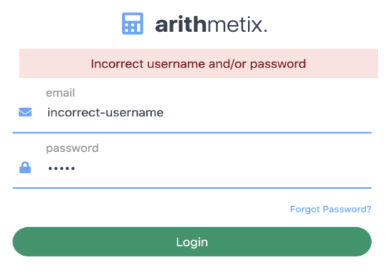

### Student Views
| Dashboard | Quizzes | Modules |
|-----------|---------|---------|
| 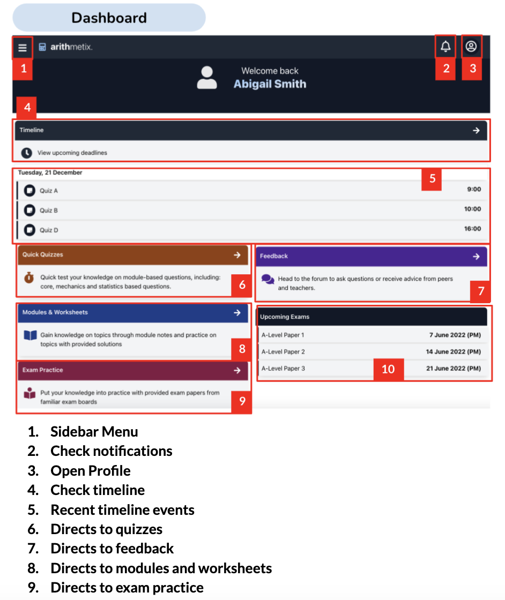 | 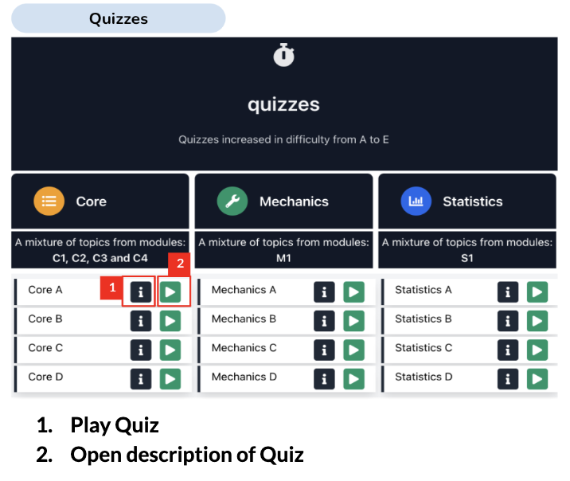 | 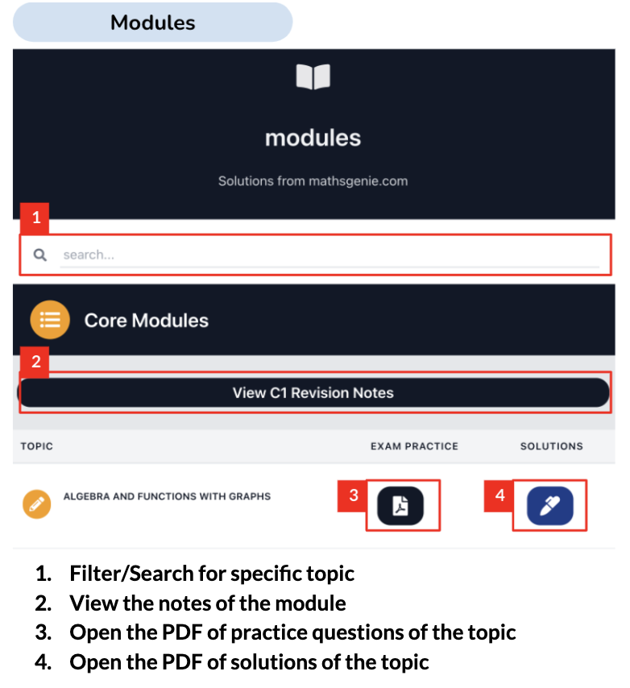 |

| Quiz in Progress | Quiz Results | Results by Category |
|-------------------|-------------|---------------------|
| 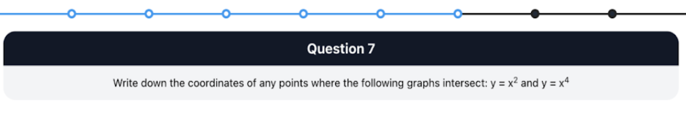 | 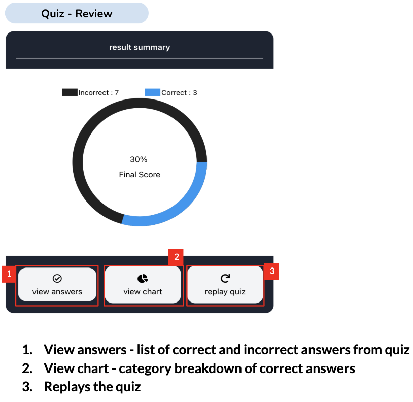 | 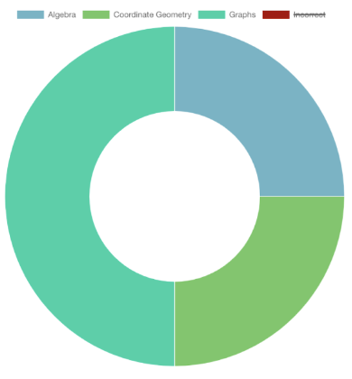 |

| Exam Papers | Module Download |
|-------------|----------------|
| 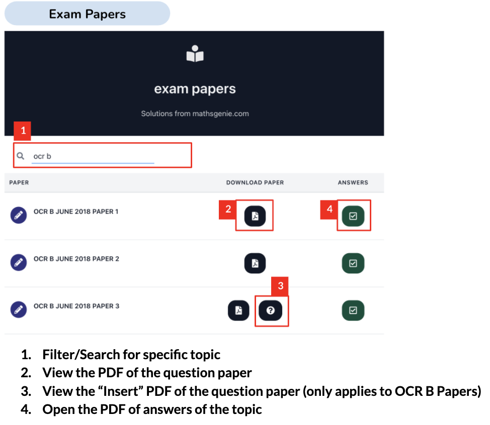 | 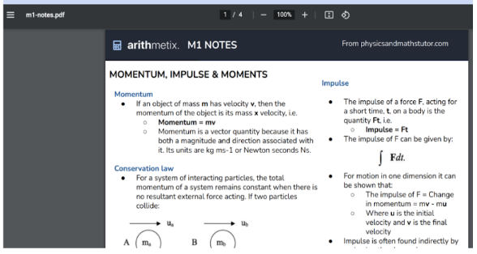 |

### Teacher Views
| Dashboard | Class Management | Assignments |
|-----------|-----------------|-------------|
| 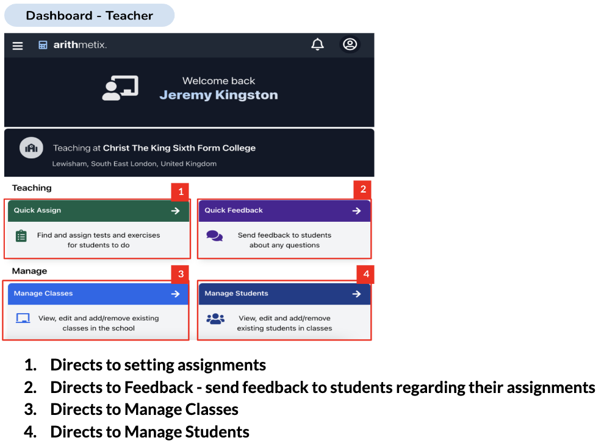 | 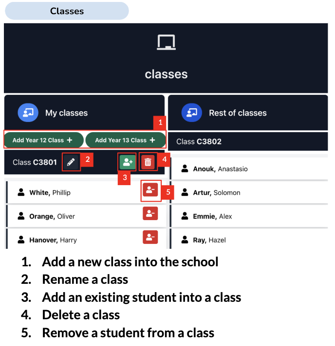 | 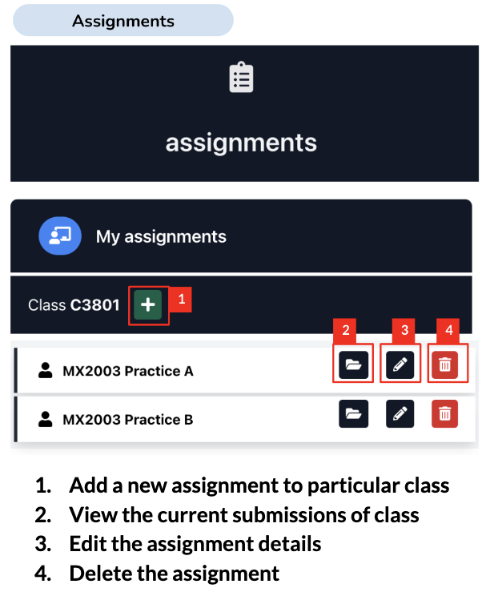 |

---

## Getting Started

### Prerequisites

- [Node.js](https://nodejs.org/) (v18+)
- [PostgreSQL](https://www.postgresql.org/) (v13+)
- npm (bundled with Node.js)

### Installation

```bash
# Clone the repository
git clone https://github.com/<your-username>/arithmetix.git
cd arithmetix

# Install backend dependencies
cd app-backend && npm install

# Install frontend dependencies
cd ../app-frontend && npm install
cd ..
```

### Database Setup

1. Start PostgreSQL:
   ```bash
   # macOS
   brew services start postgresql

   # Linux
   sudo systemctl start postgresql

   # WSL
   sudo service postgresql start
   ```

2. Initialise the database:
   ```bash
   ./factory-db.sh
   ```

   > **Troubleshooting:** If you see "role does not exist", run `sudo -u postgres createuser -s $USER`. For permission errors, run `sudo -u postgres psql -c "ALTER USER $USER WITH SUPERUSER"`.

3. To reset the database to its seed state:
   ```bash
   ./factory-db.sh reset
   ```

### Environment Configuration

```bash
cp .env.example .env
```

Edit `.env` with your settings. For email credentials you'd prefer not to store on disk:
```bash
export EMAIL_PASSWORD="your-password"
```

### Running Locally

```bash
# Terminal 1 — Start the API server (default: port 3000)
cd app-backend && npm start

# Terminal 2 — Start the frontend dev server (default: port 8080)
cd app-frontend && npm start
```

### Test Credentials

| Role | Email | Password |
|------|-------|----------|
| Student | `testuser1@gmail.com` | `student` |
| Student | `testuser2@gmail.com` | `student` |
| Teacher | `testteacher1@gmail.com` | `teacher` |

> Full seed data is defined in [`app-backend/sql/3-populate.sql`](app-backend/sql/3-populate.sql).

---

## Project Structure

```
├── app-backend/                  # Express API server
│   ├── src/
│   │   ├── app.js                # Server entry point & route definitions (25+ endpoints)
│   │   ├── db.js                 # PostgreSQL data-access layer (parameterised queries)
│   │   ├── eps.js                # Exam paper resource loader (Singleton)
│   │   ├── rn.js                 # Revision notes resource loader (Singleton)
│   │   ├── ws.js                 # Worksheet resource loader (Singleton)
│   │   ├── quiz.js               # Quiz engine (CSV parsing, shuffle, question selection)
│   │   └── config/index.js       # Environment variable configuration
│   ├── sql/                      # Database schema & seed data
│   │   ├── 1-tables.sql          # 8-table relational schema with pgcrypto
│   │   ├── 2-user.sql            # Database role creation
│   │   └── 3-populate.sql        # Seed data (24 students, 2 teachers, 6 schools)
│   └── test/                     # Jest test suites
│
├── app-frontend/                 # Vue 2 SPA
│   ├── src/
│   │   ├── App.vue               # Root component
│   │   ├── main.js               # Vue instance, plugin registration
│   │   ├── router/index.js       # Route definitions with auth guards
│   │   ├── plugins/axios.js      # Axios HTTP client configuration
│   │   ├── css/                  # TailwindCSS base + custom quiz styles
│   │   └── components/
│   │       ├── general/          # Shared UI (Login, Navigation, Alert, Confirm, etc.)
│   │       ├── student/          # Student views (Dashboard, Quizzes, Modules, etc.)
│   │       └── teacher/          # Teacher views (Classes, Assignments, ClassForm)
│   ├── webpack.common.js         # Shared Webpack 5 configuration
│   ├── webpack.dev.js            # Development build (source maps, HMR)
│   ├── webpack.prod.js           # Production build (minification, content hashing)
│   └── tailwind.config.js        # TailwindCSS 3 configuration
│
├── factory-db.sh                 # Database initialisation/reset script
├── ecosystem.config.js           # PM2 process manager configuration
├── render.yaml                   # Render.com deployment blueprint
├── DEPLOYMENT.md                 # Cloud deployment guide (Render, Netlify, Vercel)
└── QUICKSTART.md                 # Quick-start deployment steps
```

---

## API Reference

### Authentication
| Method | Endpoint | Description |
|--------|----------|-------------|
| POST | `/login` | Authenticate user, returns JWT token + user profile |

### Resources (Public)
| Method | Endpoint | Description |
|--------|----------|-------------|
| GET | `/get_exam_papers` | List all exam papers (AQA, Edexcel, OCR) |
| GET | `/get_revision_notes` | List revision notes by module |
| GET | `/get_practice_worksheets` | List worksheets with solutions |
| GET | `/get_quizzes` | List available quiz pools |
| POST | `/generate_quiz` | Generate 10 randomised questions from a pool |
| GET | `/get_quiz_data` | Retrieve generated quiz questions |
| GET | `/open_pdf` | Serve a PDF file (with path-traversal protection) |

### Class Management (Teacher)
| Method | Endpoint | Description |
|--------|----------|-------------|
| POST | `/add_class` | Create a new class |
| POST | `/rename_class` | Rename an existing class |
| POST | `/delete_class` | Delete a class |
| POST | `/add_students_to_class` | Assign students to a class |
| POST | `/remove_students_from_class` | Remove students from a class |

### Assignments & Submissions
| Method | Endpoint | Description |
|--------|----------|-------------|
| POST | `/add_assignment` | Create a new assignment |
| POST | `/edit_assignment` | Update assignment details |
| POST | `/delete_assignment` | Delete assignment and related data |
| POST | `/send_submission` | Submit student work |
| POST | `/update_feedback` | Grade a submission with feedback |

> See [`app-backend/src/app.js`](app-backend/src/app.js) for the complete list of 25+ endpoints.

---

## Testing

```bash
cd app-backend
npm test
```

Tests use **Jest 29** and cover resource loader instantiation and file parsing for exam papers, revision notes, and worksheets.

---

## Deployment

The application supports multiple deployment targets:

| Component | Platform | Configuration |
|-----------|----------|--------------|
| Backend + DB | [Render](https://render.com) | [`render.yaml`](render.yaml) (Blueprint auto-detection) |
| Frontend | [Netlify](https://netlify.com) | [`netlify.toml`](app-frontend/netlify.toml) |
| Frontend | [Vercel](https://vercel.com) | [`vercel.json`](app-frontend/vercel.json) |
| Process Manager | PM2 | [`ecosystem.config.js`](ecosystem.config.js) |

See [DEPLOYMENT.md](DEPLOYMENT.md) for step-by-step instructions.

---

## Author

**Neka Toni-Uebari**
