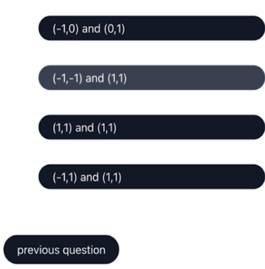

# arithmetix. Application - e-learning maths application

A full-stack e-learning maths website application to help Maths A-level students in preparation for their exams. This application provides theoretical materials of modules which correspond to the specifications of standard A-level maths exam boards (Edexcel, AQA and OCR) as well as practical resources (e.g. quizzes and exam papers) for students to test and improve their knowledge and skills on particular modules. The roles of this application include the administrator, the student and the user.

Technology Stack: VueJS, TailwindCSS, Webpack, NodeJS, Express, PostgreSQL.

## The main features of the system:
**Login:** Login section which includes pre-set database of school admins and students. There is also user authentication using JWT tokens.


**Dashboard (student):** The dashboard section to welcome the user.


**Dashboard (teacher):** The dashboard section to welcome the teacher (the admin).


**Manage classes (teacher):** The teacher's (admin) management of their classes.


**Manage assignments (teacher):** The teacher's (admin) management of setting assignments for students.


**View modules:** View and download module notes of the syllabus (Core, Mechanics and Statistics).


**View exam papers:** View and download exam papers from the exam boards of AQA, Edexecel, OCR.


**Quiz:** Practice quizzes from the module content (Core, Mechanics and Statistics)




**Quiz review:** Review the score and performance on the quiz, including a breakdown of correct and incorrect answers and by category.


## Login details (Development)
There are test users in this system to test the system in various rules as a student or a teacher. The user credentials can also be configured in the '3-populate.sql' SQL file which populates the data.

As a student...
Username: 'testuser1@gmail.com' Password: 'student'
Username: 'testuser2@gmail.com' Password: 'student'
Username: 'testuser3@gmail.com' Password: 'student' ...

As a teacher...
Username: 'testteacher1@gmail.com' Password: 'teacher' ...

## Dependencies

- [NodeJS](https://nodejs.org/)
- [NPM](https://www.npmjs.com/)
- [PostgreSQL](https://www.postgresql.org/)
- [PM2](https://pm2.io/) 

## Installation

After installing the dependencies, install the modules for both components:

```bash
cd app-backend
npm install
cd ../app-frontend
npm install
cd ..

```

### Configuration

```bash
cp .env.example .env
nano .env
```
Where the email credentials are that of a college account. If you do not wish to store the password in the config file, delete the row ```EMAIL_PASSWORD = ""``` in .env.
In the terminal:
```bash
export EMAIL_PASSWORD="YOUR PASSWORD HERE" # run this every time you restart your computer
```

### Database (for development only)

1. Start the PostgreSQL daemon if it's not already running.
   - MacOS: `brew services start postgresql`
   - GNU/Linux: `sudo systemctl start postgresql`
   - WSL: `sudo service postgresql start`
2. Run the database creation script: `./factory-db.sh`
   - If you are getting errors along the lines of "Fatal: role does not exist", you need to create a new superuser role for yourself.
     - `sudo -u postgres createuser -s $USER`
   - If you are getting errors errors along the lines of "Error: permission denied" or "insufficient privileges", you must grant yourself superuser privileges.
     - `sudo -u postgres psql -c "ALTER USER $USER WITH SUPERUSER"`

### Factory reset database

This will delete all the students, teachers, schools and other data added to the database system, then create a new one.

```sh
    ./factory-db.sh reset
```
## Tips
### Editor
If using vscode, the eslint and tailwind extensions proved very helpful for development.

### Hot Reload
Hot reload can be configured for the backend, which is useful to see changes in realtime when developing.

```bash
npm i -g nodemon
cd app-backend 
nodemon start # (instead of npm start)
```
### Testing
Edit local storage values in the browser console to test for different user types

## Usage

1. Run the API (backend) with: `cd app-backend && npm start`
2. Run the Vue frontend with: `cd app-frontend && npm start`

## Deployment (Assumption: Ubuntu. Similar steps for other environments)
* Steps 0: The server should be configured to expose the ports in the configuration file and those used by nginx (80,443). Make sure to fill in the server domain/ip in the .env file etc. see Configuration.

Make sure NodeJS is installed and you have ran `npm i` in the app-frontend and app-backend directories. Make sure postgres is installed, and you have ran the initialisation script `./factory-db.sh`.

* Step 1:
build the vue app (the frontend)
`cd app-frontend && npm run build`

* Step 2:
Install ningx
```bash
sudo apt-get update
sudo apt-get -y install nginx
sudo systemctl enable nginx # tell nginx to auto start
sudo systemctl start nginx # start nginx
```
Visit the servers IP address in the web browser. You should see the default nginx splash page.

* Step 3: replace the default nginx page with the build files
```bash
nano /var/www/html/index.html # change something in the default page then visit the server IP, it should have changed
cd .. # if not already in project root
rm -rf /var/www/html # delete folder
mkdir /var/www/html # make new empty folder in same location
cp ./app-frontend/build /var/www/html # copy build files
```
Visit the servers IP address in the web browser. You should see the login page.

* Step 4: 
Install PM2 and set to auto-start. If you wish to configure pm2, edit the ecosystem.config.js file.
```bash
npm install -g pm2
sudo pm2 save 
sudo pm2 startup
```
* Step 5 Start PM2:
`pm2 start`
* Step 6  Set up https (certificate + serve html on port 443 etc)  TODO !important 


## Authors

- Neka Toni-Uebari
